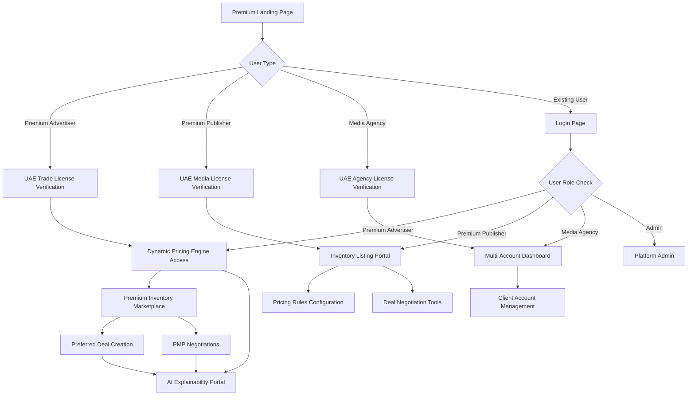

## 1. Product Overview
ElevenAds is a premium programmatic advertising platform exclusively serving the UAE market, specializing in OOH, DOOH, streaming radio/video, apps, and web inventory. The platform enables dynamic pricing through AI-powered algorithms and provides complete transparency in pricing decisions.

- **Problem Solved**: Eliminates opaque pricing in premium UAE advertising inventory while providing AI-driven dynamic pricing optimization
- **Target Users**: Premium advertisers, media agencies, and premium publishers in the UAE market
- **Market Value**: Captures the premium segment of UAE's $2+ billion advertising market with transparent programmatic guaranteed deals

## 2. Core Features

### 2.1 User Roles
| Role | Registration Method | Core Permissions |
|------|---------------------|------------------|
| Premium Advertiser | Business registration + UAE trade license verification | Access premium inventory, create PMP deals, view AI pricing explanations |
| Premium Publisher | Domain verification + UAE media license validation | List premium inventory, set dynamic pricing rules, access detailed analytics |
| Media Agency | UAE agency license + client portfolio review | Manage multiple advertiser accounts, preferred deal negotiations |
| Admin | Internal invitation only | Platform oversight, deal approval, AI model configuration |

### 2.2 Feature Module
ElevenAds premium programmatic platform consists of the following main pages:
1. **Premium Dashboard**: AI pricing insights, deal pipeline, market intelligence
2. **Dynamic Pricing Engine**: Base price settings, demand multipliers, time-based adjustments
3. **Deal Management**: Preferred deals, PMP negotiations, programmatic guaranteed contracts
4. **AI Explainability Portal**: Pricing decision transparency, algorithm insights, market factors
5. **Premium Inventory Marketplace**: OOH/DOOH listings, streaming inventory, app/web premium slots
6. **Market Analytics**: UAE-specific market data, pricing trends, inventory availability

### 2.3 Page Details
| Page Name | Module Name | Feature description |
|-----------|-------------|---------------------|
| Premium Dashboard | AI Pricing Insights | Display dynamic pricing recommendations, market demand indicators, pricing trend analysis |
| Premium Dashboard | Deal Pipeline | Track preferred deals, PMP negotiations, programmatic guaranteed contracts |
| Dynamic Pricing Engine | Base Price Settings | Configure inventory base prices by media type, location, audience segments |
| Dynamic Pricing Engine | Demand Multipliers | Set demand-based pricing adjustments, seasonal factors, event-based multipliers |
| Dynamic Pricing Engine | Time-Based Adjustments | Configure time-of-day, day-of-week, seasonal pricing variations |
| Deal Management | Preferred Deals | Create and negotiate preferred deals with fixed pricing and priority access |
| Deal Management | PMP Negotiations | Private marketplace deal creation, buyer invitations, negotiation tools |
| Deal Management | Programmatic Guaranteed | Set up guaranteed inventory deals with fixed volumes and pricing |
| AI Explainability Portal | Pricing Decision Transparency | View detailed explanations for pricing recommendations, factor weights, market data |
| AI Explainability Portal | Algorithm Insights | Access AI model performance metrics, accuracy tracking, improvement suggestions |
| Premium Inventory Marketplace | OOH/DOOH Listings | Browse outdoor and digital outdoor inventory with location mapping, audience data |
| Premium Inventory Marketplace | Streaming Inventory | Access premium streaming radio and video inventory with audience demographics |
| Market Analytics | UAE Market Data | View UAE-specific market trends, seasonal patterns, pricing benchmarks |
| Market Analytics | Inventory Availability | Real-time inventory availability across all media types, booking status |

## 3. Core Process

### Premium Advertiser Flow
UAE-based advertisers begin with premium onboarding including trade license verification. They access the dynamic pricing engine to understand market rates, browse premium inventory across OOH/DOOH/streaming/apps/web, and create preferred deals or PMP negotiations. The AI explainability portal provides transparency in pricing decisions throughout the process.

### Premium Publisher Flow
UAE publishers with media licenses list their premium inventory (OOH/DOOH locations, streaming slots, app/web placements) with dynamic pricing rules. They configure base prices, demand multipliers, and time-based adjustments. The platform provides AI-driven pricing recommendations and deal negotiation tools.

### Media Agency Flow
UAE-licensed agencies manage multiple premium advertiser accounts, negotiate preferred deals on behalf of clients, and access consolidated market analytics for the UAE region.

## 4. User Interface Design

### 4.1 Design Style
- **Primary Colors**: Premium gold (#D4AF37) for luxury positioning, deep navy (#1B365D) for trust
- **Secondary Colors**: Warm white (#FEFEFE) backgrounds, sophisticated gray (#4A5568) text
- **Button Style**: Rounded corners (6px radius), premium gradients, subtle animations
- **Typography**: Playfair Display for headings, Inter for body text, 16px base size
- **Layout**: Premium card-based design with generous whitespace, elegant sidebar navigation
- **Icons**: Premium custom icons reflecting UAE luxury market, consistent gold accents

### 4.2 Page Design Overview
| Page Name | Module Name | UI Elements |
|-----------|-------------|-------------|
| Premium Dashboard | AI Pricing Insights | Premium card layout with gold accents, interactive pricing charts, demand heatmaps, elegant typography |
| Dynamic Pricing Engine | Price Configuration | Sophisticated form controls, real-time price previews, factor weight sliders, premium UI elements |
| Deal Management | PMP Interface | Professional negotiation interface, deal status indicators, elegant contract previews |
| AI Explainability Portal | Transparency Dashboard | Clear factor visualization, confidence scores, market data integration with premium styling |

### 4.3 Responsiveness
Desktop-first design approach with mobile adaptation. Breakpoints at 768px (tablet) and 1024px (desktop). Touch-optimized interactions for mobile devices, collapsible navigation menus, and responsive data tables.

### 4.4 3D Scene Guidance
Not applicable for this advertising platform.

## 5. Milestones

### Phase 1: Foundation (Weeks 1-4)
- User authentication system
- Basic dashboard with mock data
- User registration and verification
- Core database schema

### Phase 2: Core Features (Weeks 5-8)
- Campaign creation wizard
- Basic analytics dashboard
- Publisher portal setup
- Payment integration setup

### Phase 3: Advanced Features (Weeks 9-12)
- Real-time bidding system
- Advanced targeting options
- Conversion tracking
- API development

### Phase 4: Optimization (Weeks 13-16)
- Performance optimization
- Advanced reporting features
- Mobile app development
- Load testing and scaling