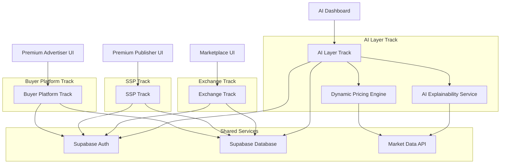
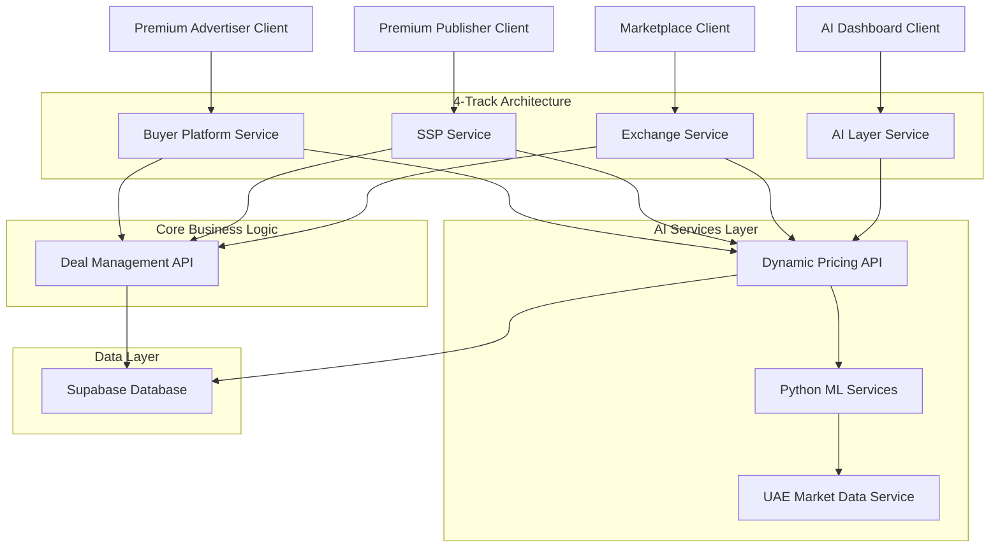
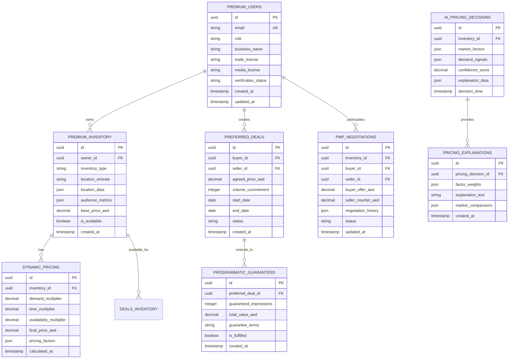

## 1. Architecture Design



## 2. Technology Description

- **Buyer Platform Frontend**: React@18 + TypeScript + Tailwind CSS@3 + Vite
- **SSP Frontend**: React@18 + TypeScript + Tailwind CSS@3 + Vite
- **Exchange Frontend**: React@18 + TypeScript + Tailwind CSS@3 + Vite
- **AI Layer Frontend**: React@18 + TypeScript + Tailwind CSS@3 + Vite
- **Initialization Tool**: vite-init
- **Backend Services**: Node.js@18 + Express@4 + TypeScript (4 separate services)
- **Database**: Supabase (PostgreSQL) with separate schemas per track
- **Authentication**: Supabase Auth with role-based access
- **AI/ML**: Python FastAPI services for dynamic pricing algorithms
- **State Management**: React Context + Zustand
- **Charts/Analytics**: Chart.js + D3.js for market visualizations
- **UI Components**: Premium custom components with UAE market styling
- **Form Handling**: React Hook Form + Zod validation

## 3. Route Definitions

### Buyer Platform Routes
| Route | Purpose |
|-------|---------|
| /buyer | Premium advertiser dashboard with AI pricing insights |
| /buyer/inventory | Browse premium OOH/DOOH/streaming/app/web inventory |
| /buyer/deals | Create and manage preferred deals and PMP negotiations |
| /buyer/analytics | UAE market analytics and pricing trends |

### SSP Routes
| Route | Purpose |
|-------|---------|
| /ssp | Premium publisher dashboard |
| /ssp/inventory | Manage OOH/DOOH/streaming/app/web inventory |
| /ssp/pricing | Dynamic pricing engine configuration |
| /ssp/deals | Manage incoming deal requests and negotiations |

### Exchange Routes
| Route | Purpose |
|-------|---------|
| /exchange | Premium marketplace dashboard |
| /exchange/marketplace | Browse all available premium inventory |
| /exchange/deals | Active deal negotiations and agreements |
| /exchange/analytics | Market-wide pricing and inventory analytics |

### AI Layer Routes
| Route | Purpose |
|-------|---------|
| /ai | AI explainability dashboard |
| /ai/pricing-insights | Dynamic pricing algorithm explanations |
| /ai/market-factors | UAE market factor analysis and weights |
| /ai/performance | AI model accuracy and improvement metrics |

## 4. API Definitions

### 4.1 Authentication APIs

```
POST /api/auth/register-premium
```

Request:
| Param Name | Param Type | isRequired | Description |
|------------|------------|-------------|-------------|
| email | string | true | Business email address |
| password | string | true | User password (min 12 chars) |
| role | string | true | User role (premium_advertiser/premium_publisher/media_agency) |
| business_name | string | true | UAE registered business name |
| trade_license | string | true | UAE trade license number |
| media_license | string | false | UAE media license (for publishers) |

Response:
| Param Name | Param Type | Description |
|------------|-------------|-------------|
| user_id | string | Unique user identifier |
| role | string | Assigned user role |
| verification_status | string | License verification status |
| token | string | JWT access token |

### 4.2 Dynamic Pricing APIs

```
POST /api/pricing/calculate
```

Request:
| Param Name | Param Type | isRequired | Description |
|------------|------------|-------------|-------------|
| inventory_type | string | true | Media type (OOH/DOOH/streaming_radio/streaming_video/app/web) |
| location | object | true | UAE location data (emirate, area, coordinates) |
| time_slot | object | true | Time-based pricing parameters |
| demand_indicators | object | true | Market demand signals |
| availability_score | number | true | Current inventory availability (0-1) |

Response:
| Param Name | Param Type | Description |
|------------|-------------|-------------|
| base_price | number | Calculated base price in AED |
| demand_multiplier | number | Applied demand adjustment factor |
| time_multiplier | number | Applied time-based adjustment |
| final_price | number | Final calculated price |
| explanation | object | AI pricing decision factors |

### 4.3 Deal Management APIs

```
POST /api/deals/preferred
```

Request:
| Param Name | Param Type | isRequired | Description |
|------------|------------|-------------|-------------|
| inventory_id | string | true | Premium inventory identifier |
| buyer_id | string | true | Premium advertiser/agency ID |
| proposed_price | number | true | Offered price in AED |
| volume_commitment | number | true | Guaranteed volume commitment |
| deal_terms | object | true | Deal duration and conditions |

```
GET /api/deals/:id/negotiation-status
```

Response:
| Param Name | Param Type | Description |
|------------|-------------|-------------|
| negotiation_id | string | Unique negotiation identifier |
| current_offer | number | Current offer price |
| counter_offer | number | Publisher counter offer |
| status | string | Negotiation status |
| ai_recommendation | object | AI negotiation guidance |

### 4.4 Premium Inventory APIs

```
POST /api/inventory/premium
```

Request:
| Param Name | Param Type | isRequired | Description |
|------------|------------|-------------|-------------|
| inventory_type | string | true | Media type (OOH/DOOH/streaming_radio/streaming_video/app/web) |
| location_data | object | true | UAE location and positioning data |
| audience_metrics | object | true | Premium audience demographics |
| availability_schedule | object | true | Time-based availability rules |
| base_price_config | object | true | Dynamic pricing base configuration |

## 5. Server Architecture Diagram



## 6. Data Model

### 6.1 Data Model Definition



### 6.2 Data Definition Language

```sql
-- Premium Users table
CREATE TABLE premium_users (
    id UUID PRIMARY KEY DEFAULT gen_random_uuid(),
    email VARCHAR(255) UNIQUE NOT NULL,
    password_hash VARCHAR(255) NOT NULL,
    role VARCHAR(30) NOT NULL CHECK (role IN ('premium_advertiser', 'premium_publisher', 'media_agency', 'admin')),
    business_name VARCHAR(255) NOT NULL,
    trade_license VARCHAR(50) NOT NULL,
    media_license VARCHAR(50),
    verification_status VARCHAR(20) DEFAULT 'pending' CHECK (verification_status IN ('pending', 'verified', 'rejected')),
    created_at TIMESTAMP WITH TIME ZONE DEFAULT NOW(),
    updated_at TIMESTAMP WITH TIME ZONE DEFAULT NOW()
);

-- Premium Inventory table
CREATE TABLE premium_inventory (
    id UUID PRIMARY KEY DEFAULT gen_random_uuid(),
    owner_id UUID REFERENCES premium_users(id) ON DELETE CASCADE,
    inventory_type VARCHAR(30) NOT NULL CHECK (inventory_type IN ('OOH', 'DOOH', 'streaming_radio', 'streaming_video', 'app', 'web')),
    location_emirate VARCHAR(50) NOT NULL,
    location_data JSONB NOT NULL,
    audience_metrics JSONB NOT NULL,
    base_price_aed DECIMAL(10,2) NOT NULL CHECK (base_price_aed > 0),
    is_available BOOLEAN DEFAULT true,
    created_at TIMESTAMP WITH TIME ZONE DEFAULT NOW(),
    updated_at TIMESTAMP WITH TIME ZONE DEFAULT NOW()
);

-- Dynamic Pricing table
CREATE TABLE dynamic_pricing (
    id UUID PRIMARY KEY DEFAULT gen_random_uuid(),
    inventory_id UUID REFERENCES premium_inventory(id) ON DELETE CASCADE,
    demand_multiplier DECIMAL(5,2) DEFAULT 1.00,
    time_multiplier DECIMAL(5,2) DEFAULT 1.00,
    availability_multiplier DECIMAL(5,2) DEFAULT 1.00,
    final_price_aed DECIMAL(10,2) NOT NULL,
    pricing_factors JSONB NOT NULL,
    calculated_at TIMESTAMP WITH TIME ZONE DEFAULT NOW()
);

-- Preferred Deals table
CREATE TABLE preferred_deals (
    id UUID PRIMARY KEY DEFAULT gen_random_uuid(),
    buyer_id UUID REFERENCES premium_users(id) ON DELETE CASCADE,
    seller_id UUID REFERENCES premium_users(id) ON DELETE CASCADE,
    inventory_id UUID REFERENCES premium_inventory(id) ON DELETE CASCADE,
    agreed_price_aed DECIMAL(10,2) NOT NULL,
    volume_commitment INTEGER NOT NULL,
    start_date DATE NOT NULL,
    end_date DATE NOT NULL,
    status VARCHAR(20) DEFAULT 'draft' CHECK (status IN ('draft', 'active', 'completed', 'cancelled')),
    created_at TIMESTAMP WITH TIME ZONE DEFAULT NOW(),
    updated_at TIMESTAMP WITH TIME ZONE DEFAULT NOW()
);

-- PMP Negotiations table
CREATE TABLE pmp_negotiations (
    id UUID PRIMARY KEY DEFAULT gen_random_uuid(),
    inventory_id UUID REFERENCES premium_inventory(id) ON DELETE CASCADE,
    buyer_id UUID REFERENCES premium_users(id) ON DELETE CASCADE,
    seller_id UUID REFERENCES premium_users(id) ON DELETE CASCADE,
    buyer_offer_aed DECIMAL(10,2) NOT NULL,
    seller_counter_aed DECIMAL(10,2),
    negotiation_history JSONB DEFAULT '[]',
    status VARCHAR(20) DEFAULT 'active' CHECK (status IN ('active', 'accepted', 'rejected', 'expired')),
    created_at TIMESTAMP WITH TIME ZONE DEFAULT NOW(),
    updated_at TIMESTAMP WITH TIME ZONE DEFAULT NOW()
);

-- AI Pricing Decisions table
CREATE TABLE ai_pricing_decisions (
    id UUID PRIMARY KEY DEFAULT gen_random_uuid(),
    inventory_id UUID REFERENCES premium_inventory(id) ON DELETE CASCADE,
    market_factors JSONB NOT NULL,
    demand_signals JSONB NOT NULL,
    confidence_score DECIMAL(3,2) NOT NULL CHECK (confidence_score >= 0 AND confidence_score <= 1),
    explanation_data JSONB NOT NULL,
    decision_time TIMESTAMP WITH TIME ZONE DEFAULT NOW()
);

-- Programmatic Guaranteed table
CREATE TABLE programmatic_guaranteed (
    id UUID PRIMARY KEY DEFAULT gen_random_uuid(),
    preferred_deal_id UUID REFERENCES preferred_deals(id) ON DELETE CASCADE,
    guaranteed_impressions INTEGER NOT NULL,
    total_value_aed DECIMAL(10,2) NOT NULL,
    guarantee_terms JSONB NOT NULL,
    is_fulfilled BOOLEAN DEFAULT false,
    created_at TIMESTAMP WITH TIME ZONE DEFAULT NOW(),
    updated_at TIMESTAMP WITH TIME ZONE DEFAULT NOW()
);

-- Pricing Explanations table
CREATE TABLE pricing_explanations (
    id UUID PRIMARY KEY DEFAULT gen_random_uuid(),
    pricing_decision_id UUID REFERENCES ai_pricing_decisions(id) ON DELETE CASCADE,
    factor_weights JSONB NOT NULL,
    explanation_text TEXT NOT NULL,
    market_comparisons JSONB NOT NULL,
    created_at TIMESTAMP WITH TIME ZONE DEFAULT NOW()
);

-- Create indexes for performance
CREATE INDEX idx_premium_users_email ON premium_users(email);
CREATE INDEX idx_premium_users_role ON premium_users(role);
CREATE INDEX idx_premium_users_verification ON premium_users(verification_status);
CREATE INDEX idx_premium_inventory_owner ON premium_inventory(owner_id);
CREATE INDEX idx_premium_inventory_type ON premium_inventory(inventory_type);
CREATE INDEX idx_premium_inventory_emirate ON premium_inventory(location_emirate);
CREATE INDEX idx_dynamic_pricing_inventory ON dynamic_pricing(inventory_id);
CREATE INDEX idx_preferred_deals_buyer ON preferred_deals(buyer_id);
CREATE INDEX idx_preferred_deals_seller ON preferred_deals(seller_id);
CREATE INDEX idx_preferred_deals_status ON preferred_deals(status);
CREATE INDEX idx_pmp_negotiations_inventory ON pmp_negotiations(inventory_id);
CREATE INDEX idx_pmp_negotiations_buyer ON pmp_negotiations(buyer_id);
CREATE INDEX idx_pmp_negotiations_status ON pmp_negotiations(status);
CREATE INDEX idx_ai_pricing_inventory ON ai_pricing_decisions(inventory_id);
CREATE INDEX idx_programmatic_guaranteed_deal ON programmatic_guaranteed(preferred_deal_id);
CREATE INDEX idx_pricing_explanations_decision ON pricing_explanations(pricing_decision_id);

-- Grant permissions
GRANT SELECT ON ALL TABLES TO anon;
GRANT ALL PRIVILEGES ON ALL TABLES TO authenticated;

-- Row Level Security (RLS) policies
ALTER TABLE premium_inventory ENABLE ROW LEVEL SECURITY;
CREATE POLICY "Users can view available inventory" ON premium_inventory FOR SELECT USING (is_available = true);
CREATE POLICY "Owners can manage own inventory" ON premium_inventory FOR ALL USING (auth.uid() = owner_id);

ALTER TABLE preferred_deals ENABLE ROW LEVEL SECURITY;
CREATE POLICY "Users can view own deals" ON preferred_deals FOR SELECT USING (auth.uid() = buyer_id OR auth.uid() = seller_id);
CREATE POLICY "Users can manage own deals" ON preferred_deals FOR ALL USING (auth.uid() = buyer_id OR auth.uid() = seller_id);